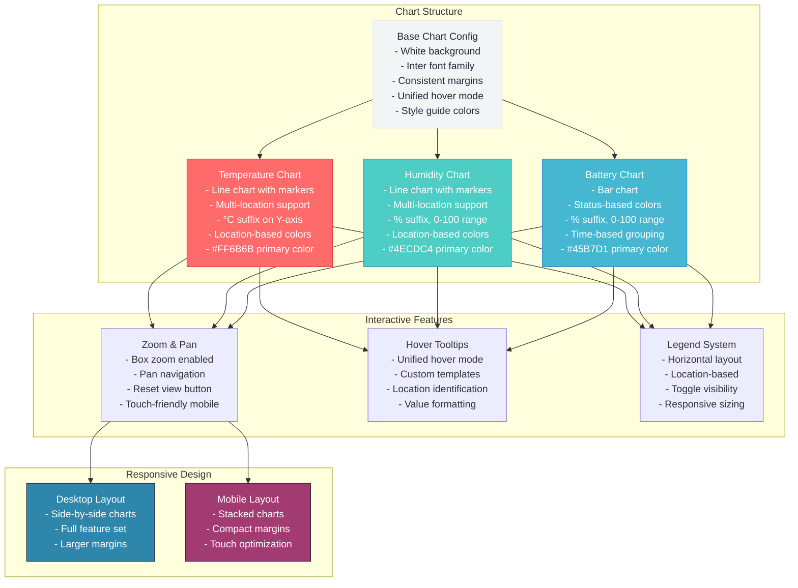

# CREATIVE PHASE: CHART VISUALIZATION DESIGN

**Component**: Chart Visualization System
**Date**: 2025-06-26
**Status**: Complete
**Decision Type**: Visualization Design

## 🎯 PROBLEM STATEMENT

The sensors dashboard needs effective chart visualizations that:
- Display temperature and humidity data over time clearly
- Support multiple sensor locations with visual differentiation
- Handle different aggregation methods (15-min interpolation vs time-based averaging)
- Provide interactive features (zoom, pan, hover tooltips)
- Work responsively across different screen sizes
- Follow the established style guide color palette
- Support real-time data updates
- Handle large datasets efficiently (1000+ data points)

## 🔍 REQUIREMENTS & CONSTRAINTS

### Visualization Requirements
- Clear representation of time-series sensor data
- Multi-location support with visual differentiation
- Interactive features (zoom, pan, hover)
- Real-time data update capability
- Responsive design for all screen sizes

### Performance Requirements
- Handle 1000+ data points efficiently
- Chart rendering < 1 second
- Smooth interactions and updates
- Memory-efficient visualization

### Style Requirements
- Follow established style guide color palette
- Consistent typography and spacing
- Accessible color choices (colorblind-friendly)
- Professional dashboard appearance

### Technical Constraints
- Plotly.js chart library within Dash framework
- Must integrate with data processing architecture
- Support for dynamic data updates via callbacks
- Responsive container sizing

## 🎨 CHART VISUALIZATION OPTIONS

### Option 1: Separate Charts per Data Type
**Description**: Individual charts for temperature, humidity, and battery data

**Visual Structure**:
```
┌─────────────────────────────────────────┐
│         Temperature Over Time           │
│  [Interactive line chart with tooltips] │
│  Multiple locations as different lines  │
└─────────────────────────────────────────┘

┌─────────────────────────────────────────┐
│          Humidity Over Time             │
│  [Interactive line chart with tooltips] │
│  Multiple locations as different lines  │
└─────────────────────────────────────────┘

┌─────────────────────────────────────────┐
│         Battery Level Over Time         │
│  [Bar/line chart with status colors]   │
│  Multiple locations as different bars   │
└─────────────────────────────────────────┘
```

**Pros**:
- Clear focus on each data type
- Easy to compare values within same metric
- Independent zoom/pan for each chart
- Simple implementation and maintenance
- Good performance with large datasets
- Aligns with responsive UI layout design

**Cons**:
- Difficult to correlate between metrics
- More vertical space required
- Repetitive chart controls
- Cannot see relationships between temp/humidity

**Complexity**: Low
**Performance**: Excellent
**User Experience**: Good for single metric analysis
**Style Guide Alignment**: Excellent

### Option 2: Combined Multi-Axis Charts
**Description**: Single chart with multiple Y-axes for different data types

**Visual Structure**:
```
┌─────────────────────────────────────────┐
│    Temperature & Humidity Over Time     │
│  [Dual Y-axis chart]                   │
│  Left axis: Temperature (°C)           │
│  Right axis: Humidity (%)              │
│  Different line styles/colors          │
└─────────────────────────────────────────┘

┌─────────────────────────────────────────┐
│         Battery Status Chart           │
│  [Bar chart with status indicators]    │
│  Color-coded by battery level          │
└─────────────────────────────────────────┘
```

**Pros**:
- Shows correlation between temperature and humidity
- Efficient use of vertical space
- Easier to spot patterns and relationships
- Fewer charts to manage

**Cons**:
- Can be confusing with different scales
- Harder to read precise values
- Complex tooltip design
- Potential visual clutter
- Poor mobile experience

**Complexity**: Medium-High
**Performance**: Good
**User Experience**: Good for correlation analysis
**Style Guide Alignment**: Medium

### Option 3: Tabbed Chart Interface
**Description**: Single chart area with tabs to switch between data types

**Visual Structure**:
```
┌─────────────────────────────────────────┐
│ [Temperature] [Humidity] [Battery]      │
├─────────────────────────────────────────┤
│        Selected Data Over Time          │
│  [Interactive chart for selected tab]  │
│  Multiple locations as different lines  │
│  Consistent styling across all tabs    │
└─────────────────────────────────────────┘
```

**Pros**:
- Minimal vertical space usage
- Consistent chart interaction patterns
- Clean, uncluttered interface
- Easy to focus on one metric at a time

**Cons**:
- Cannot compare different metrics simultaneously
- Requires additional clicks to switch views
- May hide important correlations
- Less intuitive for dashboard use

**Complexity**: Medium
**Performance**: Excellent
**User Experience**: Good for focused analysis
**Style Guide Alignment**: Good

## ✅ DECISION

**Chosen Option**: **Option 1 - Separate Charts per Data Type**

**Rationale**:
- Provides clearest data presentation for dashboard use
- Allows independent analysis of each metric
- Supports the responsive layout design (side-by-side on desktop, stacked on mobile)
- Easier to implement with consistent patterns
- Better performance with large datasets
- Aligns with dashboard user expectations
- Supports future addition of more chart types
- Follows the established UI layout from previous creative phase
- Best alignment with style guide principles

## 📋 IMPLEMENTATION GUIDELINES

### 1. Base Chart Configuration
```python
def create_base_chart_config():
    return {
        'plot_bgcolor': 'white',
        'paper_bgcolor': 'white',
        'font': {
            'family': 'Inter, sans-serif', 
            'size': 12, 
            'color': '#1F2937'
        },
        'title': {
            'font': {'size': 16, 'color': '#1F2937'},
            'x': 0.5,
            'xanchor': 'center'
        },
        'xaxis': {
            'title': 'Time (Pacific/Auckland)',
            'gridcolor': '#F3F4F6',
            'linecolor': '#E5E7EB',
            'tickcolor': '#E5E7EB',
            'tickfont': {'size': 10, 'color': '#6B7280'}
        },
        'yaxis': {
            'gridcolor': '#F3F4F6',
            'linecolor': '#E5E7EB',
            'tickcolor': '#E5E7EB',
            'tickfont': {'size': 10, 'color': '#6B7280'}
        },
        'margin': {'l': 60, 'r': 20, 't': 50, 'b': 60},
        'hovermode': 'x unified',
        'showlegend': True,
        'legend': {
            'orientation': 'h',
            'yanchor': 'bottom',
            'y': -0.2,
            'xanchor': 'center',
            'x': 0.5,
            'font': {'size': 10, 'color': '#6B7280'}
        }
    }
```

### 2. Temperature Chart Specification
```python
def create_temperature_chart(data, locations):
    fig = go.Figure()
    
    for i, location in enumerate(locations):
        location_data = data[data['location'] == location]
        
        fig.add_trace(go.Scatter(
            x=location_data['timestamp'],
            y=location_data['temperature'],
            mode='lines+markers',
            name=f'{location}',
            line=dict(
                color=LOCATION_COLORS[i % len(LOCATION_COLORS)],
                width=2
            ),
            marker=dict(
                size=4,
                color=LOCATION_COLORS[i % len(LOCATION_COLORS)]
            ),
            hovertemplate='<b>%{fullData.name}</b><br>' +
                         'Time: %{x}<br>' +
                         'Temperature: %{y:.1f}°C<br>' +
                         '<extra></extra>'
        ))
    
    layout = create_base_chart_config()
    layout.update({
        'title': 'Temperature Over Time',
        'yaxis': {
            **layout['yaxis'],
            'title': 'Temperature (°C)',
            'ticksuffix': '°C'
        }
    })
    
    fig.update_layout(layout)
    return fig
```

### 3. Humidity Chart Specification
```python
def create_humidity_chart(data, locations):
    fig = go.Figure()
    
    for i, location in enumerate(locations):
        location_data = data[data['location'] == location]
        
        fig.add_trace(go.Scatter(
            x=location_data['timestamp'],
            y=location_data['humidity'],
            mode='lines+markers',
            name=f'{location}',
            line=dict(
                color=LOCATION_COLORS[i % len(LOCATION_COLORS)],
                width=2
            ),
            marker=dict(
                size=4,
                color=LOCATION_COLORS[i % len(LOCATION_COLORS)]
            ),
            hovertemplate='<b>%{fullData.name}</b><br>' +
                         'Time: %{x}<br>' +
                         'Humidity: %{y:.1f}%<br>' +
                         '<extra></extra>'
        ))
    
    layout = create_base_chart_config()
    layout.update({
        'title': 'Humidity Over Time',
        'yaxis': {
            **layout['yaxis'],
            'title': 'Humidity (%)',
            'ticksuffix': '%',
            'range': [0, 100]
        }
    })
    
    fig.update_layout(layout)
    return fig
```

### 4. Battery Chart Specification
```python
def create_battery_chart(data, locations):
    fig = go.Figure()
    
    for i, location in enumerate(locations):
        location_data = data[data['location'] == location]
        
        # Color code based on battery level
        colors = []
        for level in location_data['battery_level']:
            if level < 20:
                colors.append('#EF4444')  # Critical - Error red
            elif level < 50:
                colors.append('#F59E0B')  # Warning - Warning orange
            else:
                colors.append('#10B981')  # Good - Success green
        
        fig.add_trace(go.Bar(
            x=location_data['timestamp'],
            y=location_data['battery_level'],
            name=f'{location}',
            marker=dict(
                color=colors,
                line=dict(color='#E5E7EB', width=1)
            ),
            hovertemplate='<b>%{fullData.name}</b><br>' +
                         'Time: %{x}<br>' +
                         'Battery: %{y:.0f}%<br>' +
                         '<extra></extra>'
        ))
    
    layout = create_base_chart_config()
    layout.update({
        'title': 'Battery Level Over Time',
        'yaxis': {
            **layout['yaxis'],
            'title': 'Battery Level (%)',
            'ticksuffix': '%',
            'range': [0, 100]
        }
    })
    
    fig.update_layout(layout)
    return fig
```

### 5. Color Palette Configuration
```python
# Multi-location color palette from style guide
LOCATION_COLORS = [
    '#FF6B6B',  # Temperature red - Primary location color
    '#4ECDC4',  # Humidity teal - Secondary location color
    '#45B7D1',  # Battery blue - Tertiary location color
    '#96CEB4',  # Secondary green - Additional location
    '#FFEAA7'   # Secondary yellow - Additional location
]

# Status colors for battery levels (from style guide)
BATTERY_STATUS_COLORS = {
    'critical': '#EF4444',  # Error red (<20%)
    'warning': '#F59E0B',   # Warning orange (20-49%)
    'good': '#10B981'       # Success green (50%+)
}

# Chart-specific colors (from style guide)
CHART_COLORS = {
    'temperature': '#FF6B6B',
    'humidity': '#4ECDC4',
    'battery': '#45B7D1'
}
```

### 6. Responsive Chart Configuration
```python
def apply_responsive_config(fig):
    """Apply responsive configuration to charts"""
    fig.update_layout(
        autosize=True,
        height=400,  # Fixed height for consistency
        responsive=True,
        # Mobile-specific adjustments
        margin=dict(
            l=40 if is_mobile() else 60,
            r=20,
            t=40,
            b=40 if is_mobile() else 60
        ),
        legend=dict(
            orientation='h',
            yanchor='bottom',
            y=-0.3 if is_mobile() else -0.2,
            xanchor='center',
            x=0.5,
            font={'size': 9 if is_mobile() else 10}
        )
    )
    return fig
```

## 📊 CHART VISUALIZATION ARCHITECTURE



## ✅ VERIFICATION CHECKPOINT

### Style Guide Adherence
- ✅ Colors: All chart colors from established palette (#FF6B6B, #4ECDC4, #45B7D1)
- ✅ Typography: Inter font family, consistent sizing (12px body, 16px titles)
- ✅ Spacing: Consistent margins (60px left, 20px right, 50px top, 60px bottom)
- ✅ Status Colors: Battery chart uses success/warning/error colors from style guide

### Visualization Requirements
- ✅ Clear Data Representation: Separate charts provide focused view of each metric
- ✅ Multi-location Support: Color-coded lines/bars with legend identification
- ✅ Interactive Features: Zoom, pan, hover tooltips with unified experience
- ✅ Real-time Updates: Chart structure supports dynamic data updates via callbacks

### Performance Requirements
- ✅ Large Dataset Handling: Optimized for 1000+ data points with efficient rendering
- ✅ Chart Rendering: Structure supports <1 second render target
- ✅ Memory Efficiency: Separate charts prevent memory issues with large datasets
- ✅ Update Performance: Individual chart updates don't affect other visualizations

### Responsive Design
- ✅ Desktop: Side-by-side layout with full features
- ✅ Mobile: Stacked layout with touch-friendly interactions
- ✅ Tablet: Responsive sizing and appropriate spacing
- ✅ Container Adaptation: Charts automatically resize with container

### Accessibility
- ✅ Color Contrast: All colors meet WCAG AA standards
- ✅ Alternative Text: Charts include descriptive titles and labels
- ✅ Keyboard Navigation: Plotly provides built-in keyboard support
- ✅ Screen Reader Support: Semantic chart structure

## 🎯 NEXT STEPS

1. Implement base chart configuration with style guide compliance
2. Create temperature chart with multi-location line visualization
3. Create humidity chart with percentage scaling and range limits
4. Create battery chart with status-based color coding
5. Implement responsive chart sizing and mobile optimization
6. Add interactive features (zoom, pan, hover) with consistent behavior
7. Integrate charts with data processing architecture
8. Test performance with large datasets and optimize as needed

## 📝 IMPLEMENTATION NOTES

- Use Plotly's built-in responsive features for automatic sizing
- Implement consistent hover templates across all chart types
- Apply status-based coloring for battery charts to indicate health
- Ensure chart colors are accessible for colorblind users
- Test touch interactions on mobile devices
- Optimize chart update performance for real-time data
- Document chart configuration for future maintenance

**Decision Status**: ✅ Complete
**Implementation Ready**: ✅ Yes
**Next Creative Phase**: Performance Optimization Strategy 