```mermaid
graph TD
    subgraph "Desktop Layout (>1024px)"
        DH[Header with Title<br>Style: h1, Primary Blue]
        DC[Control Panel - Horizontal Row<br>4 columns, Card style]
        DS[Statistics Cards - 3 Column Grid<br>Stats card style, Monospace data]
        DCH[Charts - Side by Side<br>2 columns, Chart colors]
    end
    
    subgraph "Tablet Layout (768-1023px)"
        TH[Header with Title<br>Style: h1, Primary Blue]
        TC[Control Panel - 2x2 Grid<br>Responsive columns]
        TS[Statistics Cards - 2x2 Grid<br>Stats card style]
        TCH[Charts - Stacked Vertically<br>Full width each]
    end
    
    subgraph "Mobile Layout (<768px)"
        MH[Header with Title<br>Style: h1, Primary Blue]
        MC[Control Panel - Vertical Stack<br>Full width components]
        MS[Statistics Cards - Vertical Stack<br>Full width each]
        MCH[Charts - Vertical Stack<br>Full width each]
    end
    
    DH --> DC --> DS --> DCH
    TH --> TC --> TS --> TCH
    MH --> MC --> MS --> MCH
    
    style DH fill:#2E86AB,stroke:#1F2937,color:white
    style TH fill:#2E86AB,stroke:#1F2937,color:white
    style MH fill:#2E86AB,stroke:#1F2937,color:white
```

# CREATIVE PHASE: DASHBOARD UI/UX DESIGN

**Component**: Dashboard Interface
**Date**: 2025-06-26
**Status**: Complete
**Decision Type**: UI/UX Design

## 🎯 PROBLEM STATEMENT

The sensors dashboard needs an intuitive and responsive user interface that:
- Displays real-time temperature, humidity, and battery data clearly
- Provides easy-to-use controls for date range selection, location filtering, and aggregation methods
- Shows statistics boxes with key metrics (latest, high, low values)
- Renders interactive charts for data visualization
- Supports multiple locations with clear visual differentiation
- Works responsively across desktop, tablet, and mobile devices
- Follows accessibility guidelines and the established style guide

## 🔍 REQUIREMENTS & CONSTRAINTS

### User Experience Requirements
- Intuitive navigation and controls
- Clear visual hierarchy for data presentation
- Responsive design for all device types
- Fast loading and smooth interactions
- Accessible design (WCAG AA compliance)

### Functional Requirements
- Date range selection with timezone awareness
- Multi-location filtering and visualization
- Dynamic aggregation method selection
- Real-time data refresh capability
- Interactive charts with tooltips and zoom

### Technical Constraints
- Plotly Dash framework limitations
- Dash Bootstrap Components for responsiveness
- Must follow established style guide (`memory-bank/style-guide.md`)
- Performance targets: <3 second load, <1 second chart render

## 🎨 UI/UX OPTIONS

### Option 1: Traditional Dashboard Layout
**Description**: Classic dashboard with top navigation, side controls, and main content area

**Layout Structure**:
```
┌─────────────────────────────────────────────────────────────┐
│                    Header Navigation                        │
├─────────────────────────────────────────────────────────────┤
│ Side │                Main Content Area                     │
│ Panel│  ┌─────────────┐ ┌─────────────┐ ┌─────────────┐   │
│      │  │ Stats Box 1 │ │ Stats Box 2 │ │ Stats Box 3 │   │
│ Date │  └─────────────┘ └─────────────┘ └─────────────┘   │
│ Range│                                                     │
│      │  ┌─────────────────────────────────────────────┐   │
│ Loc  │  │         Temperature Chart                   │   │
│ Sel  │  └─────────────────────────────────────────────┘   │
│      │                                                     │
│ Agg  │  ┌─────────────────────────────────────────────┐   │
│ Sel  │  │          Humidity Chart                     │   │
│      │  └─────────────────────────────────────────────┘   │
└─────────────────────────────────────────────────────────────┘
```

**Pros**:
- Familiar dashboard pattern
- Clear separation of controls and content
- Efficient use of horizontal space
- Easy to add more controls

**Cons**:
- Poor mobile responsiveness
- Side panel takes valuable space
- Controls separated from related content
- Complex responsive layout

**Usability**: Good on desktop, poor on mobile
**Implementation**: Medium complexity
**Accessibility**: Good with proper ARIA labels
**Style Guide Alignment**: Medium

### Option 2: Vertical Stack Layout
**Description**: Mobile-first design with vertical stacking of all components

**Layout Structure**:
```
┌─────────────────────────────────────────────────────────────┐
│                    Header with Title                        │
├─────────────────────────────────────────────────────────────┤
│                   Control Panel                             │
│  [Date Range] [Locations] [Aggregation] [Refresh]          │
├─────────────────────────────────────────────────────────────┤
│  ┌─────────────┐ ┌─────────────┐ ┌─────────────┐           │
│  │ Stats Box 1 │ │ Stats Box 2 │ │ Stats Box 3 │           │
│  └─────────────┘ └─────────────┘ └─────────────┘           │
├─────────────────────────────────────────────────────────────┤
│  ┌─────────────────────────────────────────────────────┐   │
│  │              Temperature Chart                      │   │
│  └─────────────────────────────────────────────────────┘   │
├─────────────────────────────────────────────────────────────┤
│  ┌─────────────────────────────────────────────────────┐   │
│  │               Humidity Chart                        │   │
│  └─────────────────────────────────────────────────────┘   │
└─────────────────────────────────────────────────────────────┘
```

**Pros**:
- Excellent mobile responsiveness
- Simple, clean layout
- Controls near related content
- Easy to scan vertically

**Cons**:
- Requires more vertical scrolling
- Less efficient use of wide screens
- Limited space for additional features
- May feel cramped on desktop

**Usability**: Excellent on mobile, adequate on desktop
**Implementation**: Low complexity
**Accessibility**: Excellent with logical flow
**Style Guide Alignment**: High

### Option 3: Adaptive Grid Layout
**Description**: Responsive grid that adapts based on screen size with contextual controls

**Layout Structure**:
```
Desktop Layout:
┌─────────────────────────────────────────────────────────────┐
│                Header with Controls                         │
│  [Date Range] [Locations] [Aggregation] [Refresh]          │
├─────────────────────────────────────────────────────────────┤
│  ┌─────────────┐ ┌─────────────┐ ┌─────────────┐           │
│  │ Stats Box 1 │ │ Stats Box 2 │ │ Stats Box 3 │           │
│  └─────────────┘ └─────────────┘ └─────────────┘           │
├─────────────────────────────────────────────────────────────┤
│  ┌─────────────────────┐ ┌─────────────────────┐           │
│  │ Temperature Chart   │ │ Humidity Chart      │           │
│  │                     │ │                     │           │
│  └─────────────────────┘ └─────────────────────┘           │
└─────────────────────────────────────────────────────────────┘

Mobile Layout:
┌─────────────────┐
│     Header      │
├─────────────────┤
│ Control Panel   │
│ (Collapsible)   │
├─────────────────┤
│   Stats Row     │
├─────────────────┤
│ Temperature     │
│     Chart       │
├─────────────────┤
│   Humidity      │
│     Chart       │
└─────────────────┘
```

**Pros**:
- Optimal layout for each screen size
- Efficient use of available space
- Flexible and scalable design
- Modern responsive approach
- Perfect style guide alignment

**Cons**:
- More complex implementation
- Requires careful breakpoint planning
- Testing across multiple devices needed
- Higher CSS complexity

**Usability**: Excellent across all devices
**Implementation**: High complexity
**Accessibility**: Good with proper responsive design
**Style Guide Alignment**: Excellent

## ✅ DECISION

**Chosen Option**: **Option 3 - Adaptive Grid Layout**

**Rationale**:
- Provides optimal user experience across all device types
- Efficiently uses available screen real estate
- Aligns with modern responsive design principles
- Supports future feature additions
- Follows the established style guide for responsive breakpoints
- Best balance of usability and functionality
- Matches user expectations for modern dashboard applications
- Excellent alignment with style guide responsive design principles

## 📋 IMPLEMENTATION GUIDELINES

### 1. Main Layout Structure
```python
app.layout = dbc.Container([
    # Header Section
    dbc.Row([
        dbc.Col([
            html.H1("Sensors Dashboard", 
                   className="h1 text-center mb-4",
                   style={'color': '#1F2937'}),
            html.Hr()
        ])
    ]),
    
    # Control Panel
    dbc.Row([
        dbc.Col([
            dbc.Card([
                dbc.CardBody([
                    dbc.Row([
                        dbc.Col([
                            html.Label("Date Range", className="label"),
                            dcc.DatePickerRange(
                                id='date-range',
                                style=input_style
                            )
                        ], width=12, lg=3),
                        dbc.Col([
                            html.Label("Locations", className="label"),
                            dcc.Dropdown(
                                id='location-selector', 
                                multi=True,
                                style=dropdown_style
                            )
                        ], width=12, lg=3),
                        dbc.Col([
                            html.Label("Aggregation", className="label"),
                            dcc.Dropdown(
                                id='aggregation-selector',
                                style=dropdown_style
                            )
                        ], width=12, lg=3),
                        dbc.Col([
                            dbc.Button("Refresh", 
                                     id="refresh-btn",
                                     className="btn btn-primary mt-4",
                                     style=primary_button_style)
                        ], width=12, lg=3)
                    ])
                ])
            ], style=card_style, className="mb-4")
        ])
    ]),
    
    # Statistics Section
    dbc.Row([
        dbc.Col([
            create_stats_card("Latest Temperature", "temp-latest")
        ], width=12, md=6, lg=4),
        dbc.Col([
            create_stats_card("Daily High", "temp-high")
        ], width=12, md=6, lg=4),
        dbc.Col([
            create_stats_card("Daily Low", "temp-low")
        ], width=12, md=12, lg=4)
    ], className="mb-4"),
    
    # Charts Section
    dbc.Row([
        dbc.Col([
            dbc.Card([
                dbc.CardHeader([
                    html.H3("Temperature Over Time", 
                           className="h3",
                           style={'color': '#1F2937'})
                ]),
                dbc.CardBody([
                    dcc.Graph(id='temperature-chart')
                ])
            ], style=card_style)
        ], width=12, lg=6),
        dbc.Col([
            dbc.Card([
                dbc.CardHeader([
                    html.H3("Humidity Over Time", 
                           className="h3",
                           style={'color': '#1F2937'})
                ]),
                dbc.CardBody([
                    dcc.Graph(id='humidity-chart')
                ])
            ], style=card_style)
        ], width=12, lg=6)
    ])
], fluid=True, className="p-4")
```

### 2. Statistics Card Component
```python
def create_stats_card(title, value_id):
    return dbc.Card([
        dbc.CardBody([
            html.H4(title, 
                   className="h4 text-center",
                   style={'color': '#6B7280', 'marginBottom': '16px'}),
            html.P(id=value_id, 
                  className="data-large text-center mb-0",
                  style={'color': '#1F2937', 'fontFamily': 'monospace'}),
            html.P("°C", 
                  className="body-small text-center",
                  style={'color': '#6B7280', 'marginTop': '8px'})
        ])
    ], style=stats_card_style)
```

### 3. Responsive Breakpoints
```python
# Style definitions following style guide
responsive_styles = {
    'mobile': {
        'breakpoint': '(max-width: 767px)',
        'grid': 'single-column',
        'spacing': 'space-4'
    },
    'tablet': {
        'breakpoint': '(min-width: 768px) and (max-width: 1023px)',
        'grid': '2-column',
        'spacing': 'space-6'
    },
    'desktop': {
        'breakpoint': '(min-width: 1024px)',
        'grid': '3-4-column',
        'spacing': 'space-8'
    }
}
```

### 4. Accessibility Implementation
```python
# ARIA labels and semantic structure
accessibility_attributes = {
    'main_title': {'role': 'banner', 'aria-label': 'Sensors Dashboard'},
    'control_panel': {'role': 'form', 'aria-label': 'Dashboard Controls'},
    'stats_section': {'role': 'region', 'aria-label': 'Statistics Summary'},
    'charts_section': {'role': 'region', 'aria-label': 'Data Visualization'},
    'date_picker': {'aria-label': 'Select date range for data'},
    'location_selector': {'aria-label': 'Select sensor locations'},
    'aggregation_selector': {'aria-label': 'Select data aggregation method'}
}
```

## 📊 UI/UX DESIGN DIAGRAM



## ✅ VERIFICATION CHECKPOINT

### Style Guide Adherence
- ✅ Colors: All colors from established palette (#2E86AB, #1F2937, #6B7280, etc.)
- ✅ Typography: Inter font family, proper heading hierarchy, monospace for data
- ✅ Spacing: 8px grid system throughout (24px margins, 32px padding)
- ✅ Components: Card styles, button styles, input styles from style guide

### Responsive Design
- ✅ Mobile: Single column, vertical stack, touch-friendly controls
- ✅ Tablet: 2-column grids, optimized for medium screens
- ✅ Desktop: 3-4 column grids, efficient use of wide screens
- ✅ Breakpoints: Matches style guide breakpoints (768px, 1024px)

### Accessibility
- ✅ WCAG AA compliance with proper contrast ratios
- ✅ Semantic HTML structure with proper heading hierarchy
- ✅ ARIA labels for interactive elements
- ✅ Keyboard navigation support
- ✅ Screen reader compatibility

### Usability
- ✅ Intuitive control placement and grouping
- ✅ Clear visual hierarchy with proper typography
- ✅ Logical information flow from controls to data to charts
- ✅ Consistent interaction patterns
- ✅ Visual feedback for user actions

### Technical Feasibility
- ✅ Dash Bootstrap Components for responsive behavior
- ✅ Plotly charts with responsive sizing
- ✅ Performance-optimized layout structure
- ✅ Compatible with existing technology stack

## 🎯 NEXT STEPS

1. Implement responsive layout structure with Dash Bootstrap Components
2. Create reusable statistics card component
3. Implement control panel with proper styling
4. Add accessibility attributes and ARIA labels
5. Test responsive behavior across devices
6. Integrate with data processing architecture

## 📝 IMPLEMENTATION NOTES

- Use Dash Bootstrap Components classes for responsive grid system
- Apply style guide colors and typography consistently
- Implement proper error states and loading indicators
- Add hover states and transitions for better interaction feedback
- Test with screen readers and keyboard navigation
- Optimize for touch interactions on mobile devices

**Decision Status**: ✅ Complete
**Implementation Ready**: ✅ Yes
**Next Creative Phase**: Chart Visualization Design 