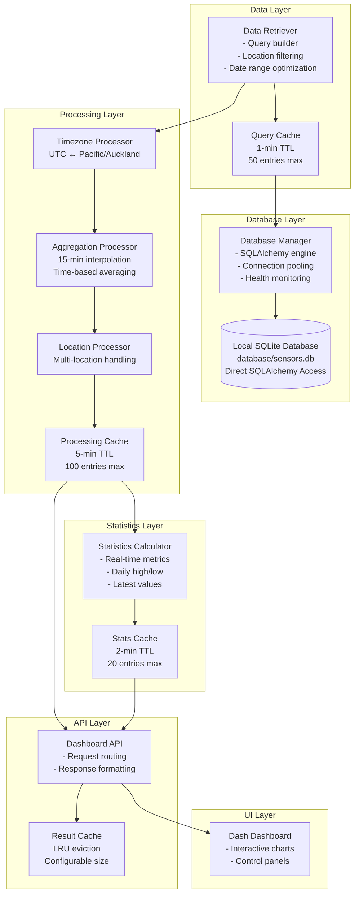

# CREATIVE PHASE: DATA PROCESSING ARCHITECTURE

**Component**: Data Processing Engine
**Date**: $(date +%Y-%m-%d)
**Status**: Complete
**Decision Type**: Architecture Design

## 🎯 PROBLEM STATEMENT

The sensors dashboard system requires a robust data processing architecture that can:
- Access local SQLite database directly via SQLAlchemy
- Process temperature, humidity, and battery data from multiple locations
- Convert between UTC and Pacific/Auckland timezones
- Provide dynamic aggregation (15-min interpolation vs hourly/daily averaging)
- Cache processed data for performance (5-min TTL, LRU eviction)
- Support real-time statistics calculation
- Scale to handle large datasets efficiently

## 🔍 REQUIREMENTS & CONSTRAINTS

### Functional Requirements
- Multi-location sensor data processing
- Timezone conversion (UTC ↔ Pacific/Auckland)
- Dynamic aggregation methods (interpolation vs averaging)
- Real-time statistics calculation
- Caching with 5-minute TTL and LRU eviction

### Non-Functional Requirements
- Page load time < 3 seconds
- Chart rendering < 1 second
- Data query response < 2 seconds
- Support for 1000+ data points
- 90%+ uptime

### Technical Constraints
- Python 3.13 with existing dependencies (pandas, pytz, SQLAlchemy)
- Local SQLite database with existing schema (`database/sensors.db`)
- Plotly Dash framework limitations

## 🎨 ARCHITECTURE OPTIONS

### Option 1: Layered Pipeline Architecture
**Description**: Sequential data processing through distinct layers
```
SQLAlchemy Connection → Raw Data Retrieval → Timezone Conversion → Aggregation Processing → Cache Storage → API Response
```

**Pros**:
- Clear separation of concerns
- Easy to test individual components
- Predictable data flow
- Easy to debug and maintain
- Follows established patterns

**Cons**:
- Potential performance bottlenecks at each layer
- Memory overhead from intermediate data structures
- Less flexible for parallel processing

**Complexity**: Medium
**Implementation Time**: 3-4 days
**Technical Fit**: High
**Scalability**: Medium

### Option 2: Event-Driven Reactive Architecture
**Description**: Asynchronous processing with event streams
```
Database Events → Data Stream → Parallel Processors (Timezone, Aggregation, Cache) → Result Aggregation → Response
```

**Pros**:
- High performance with parallel processing
- Excellent scalability
- Real-time processing capabilities
- Efficient resource utilization

**Cons**:
- Complex error handling
- Difficult to debug
- Higher implementation complexity
- Requires async/await throughout

**Complexity**: High
**Implementation Time**: 7-10 days
**Technical Fit**: Medium
**Scalability**: High

### Option 3: Hybrid Cached Pipeline Architecture
**Description**: Layered approach with intelligent caching at multiple levels
```
SQLAlchemy Pool → Query Cache → Raw Data → Processing Cache → Timezone/Aggregation → Result Cache → Response
```

**Pros**:
- Multiple caching layers for optimal performance
- Maintains simplicity of pipeline approach
- Flexible caching strategies per data type
- Good balance of performance and maintainability
- Addresses specific performance bottlenecks

**Cons**:
- Cache invalidation complexity
- Memory usage from multiple caches
- Potential cache consistency issues

**Complexity**: Medium-High
**Implementation Time**: 5-6 days
**Technical Fit**: High
**Scalability**: High

## ✅ DECISION

**Chosen Option**: **Option 3 - Hybrid Cached Pipeline Architecture**

**Rationale**: 
- Balances performance requirements with maintainability
- Multiple caching layers address the specific performance needs (database queries, processing overhead, result caching)
- Maintains clear data flow while optimizing bottlenecks
- Aligns with existing Python/Dash ecosystem patterns
- Supports the 5-minute TTL and LRU requirements effectively
- Allows for incremental optimization
- Best fit for team capabilities and project timeline
- Direct SQLite access eliminates SSH complexity and latency

## 📋 IMPLEMENTATION GUIDELINES

### 1. Database Connection Layer
```python
from sqlalchemy import create_engine
from sqlalchemy.pool import StaticPool

class DatabaseConnectionManager:
    def __init__(self, db_path="database/sensors.db"):
        self.db_path = db_path
        self.engine = create_engine(
            f'sqlite:///{db_path}',
            poolclass=StaticPool,
            pool_pre_ping=True,
            echo=False
        )
    
    def get_connection(self):
        # Return SQLAlchemy connection
        return self.engine.connect()
    
    def health_check(self):
        # Validate database connectivity
        with self.engine.connect() as conn:
            conn.execute("SELECT 1")
```

### 2. Data Retrieval Layer
```python
import pandas as pd

class DataRetriever:
    def __init__(self, db_manager, cache_manager):
        self.db_manager = db_manager
        self.cache = cache_manager
        
    def get_temperature_data(self, locations, start_time, end_time):
        cache_key = self._generate_cache_key(locations, start_time, end_time)
        if cached_data := self.cache.get(cache_key):
            return cached_data
        
        # Execute SQLAlchemy query and cache result
        query = """
        SELECT timestamp, temperature, humidity, location 
        FROM temp_humidity 
        WHERE timestamp BETWEEN ? AND ?
        AND location IN ({})
        """.format(','.join(['?'] * len(locations)))
        
        with self.db_manager.get_connection() as conn:
            data = pd.read_sql(query, conn, params=[start_time, end_time] + locations)
            
        self.cache.set(cache_key, data)
        return data
```

### 3. Processing Pipeline
```python
class DataProcessor:
    def __init__(self):
        self.timezone_processor = TimezoneProcessor()
        self.aggregation_processor = AggregationProcessor()
        self.location_processor = LocationProcessor()
        
    def process_data(self, raw_data, aggregation_method):
        # Pipeline: timezone → aggregation → location processing
        pass
```

### 4. Cache Management
```python
class CacheManager:
    def __init__(self, max_size=100):
        self.caches = {
            'query': TTLCache(maxsize=50, ttl=60),      # 1-min TTL
            'processed': TTLCache(maxsize=100, ttl=300), # 5-min TTL
            'stats': TTLCache(maxsize=20, ttl=120)      # 2-min TTL
        }
```

## 📊 ARCHITECTURE DIAGRAM



## ✅ VERIFICATION CHECKPOINT

### Requirements Coverage
- ✅ Database Access: Direct SQLAlchemy connection with pooling and health monitoring
- ✅ Multi-location Support: Location processor handles data filtering and aggregation
- ✅ Timezone Processing: Dedicated timezone processor with Pacific/Auckland support
- ✅ Dynamic Aggregation: Separate processors for interpolation vs averaging
- ✅ Caching Strategy: Multi-level caching with appropriate TTLs
- ✅ Performance: Multiple optimization points address <3 second load times
- ✅ Scalability: Connection pooling and caching support growth
- ✅ Maintainability: Clear separation of concerns in pipeline architecture

### Technical Feasibility
- ✅ Python/Dash Compatibility: All components use standard Python patterns
- ✅ Existing Dependencies: Leverages pandas, pytz, SQLAlchemy effectively  
- ✅ Memory Requirements: Configurable cache sizes with LRU eviction
- ✅ Performance Targets: Multi-level caching addresses response time requirements

### Risk Assessment
- **Cache invalidation complexity** → Simple TTL-based invalidation with manual refresh capability
- **Memory usage from multiple caches** → Configurable cache sizes with monitoring
- **Database lock contention** → SQLAlchemy connection pooling with proper transaction management

## 🎯 NEXT STEPS

1. Implement SQLAlchemy database manager with connection pooling
2. Create data retrieval layer with query caching
3. Build processing pipeline with timezone and aggregation processors
4. Implement multi-level cache management
5. Create statistics calculation engine
6. Integrate all components with Dash dashboard

## 📝 IMPLEMENTATION NOTES

- Use existing Pipfile dependencies (no additional packages required)
- Implement configuration management for cache sizes and TTLs
- Add comprehensive logging for debugging and monitoring
- Create unit tests for each component
- Document API interfaces between components
- Plan for gradual rollout and performance monitoring

**Decision Status**: ✅ Complete
**Implementation Ready**: ✅ Yes
**Next Creative Phase**: Dashboard UI/UX Design 