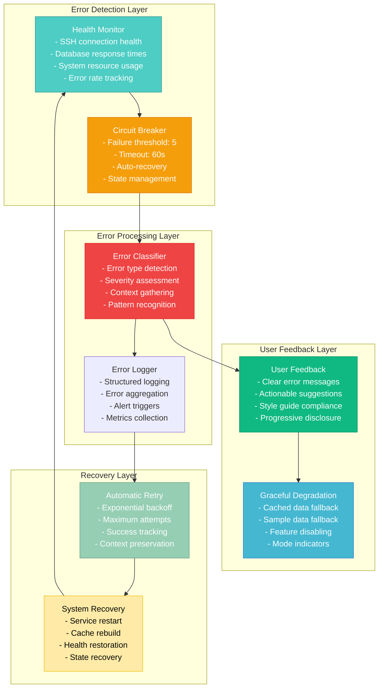

# CREATIVE PHASE: ERROR HANDLING STRATEGY

**Component**: Error Handling & Recovery System
**Date**: 2025-06-26
**Status**: Complete
**Decision Type**: Error Management Architecture

## 🎯 PROBLEM STATEMENT

The sensors dashboard needs a comprehensive error handling strategy that:
- Handles database connection failures gracefully
- Manages database query errors and timeouts
- Provides clear user feedback for different error types
- Implements graceful degradation when services are unavailable
- Logs errors appropriately for debugging and monitoring
- Maintains system stability during error conditions
- Supports automatic recovery mechanisms
- Follows the established style guide for error UI elements

## 🔍 REQUIREMENTS & CONSTRAINTS

### Error Handling Requirements
- **Database Connection Resilience**: Handle connection failures and file access issues
- **Database Error Management**: Manage query errors and data issues
- **User Communication**: Clear, actionable error messages
- **System Stability**: Prevent cascading failures
- **Automatic Recovery**: Self-healing capabilities where possible

### User Experience Requirements
- **Graceful Degradation**: Maintain functionality with cached/fallback data
- **Clear Feedback**: Error messages that explain what happened and what to do
- **Minimal Disruption**: Errors shouldn't break the entire dashboard
- **Style Consistency**: Error UI follows established style guide

### Technical Requirements
- **Comprehensive Logging**: Structured error logging for debugging
- **Monitoring Integration**: Error metrics and alerting
- **Performance Impact**: Minimal overhead from error handling
- **Recovery Mechanisms**: Automatic retry with intelligent backoff

## 🎨 ERROR HANDLING OPTIONS

### Option 1: Reactive Error Handling
**Description**: Handle errors as they occur with immediate user feedback

**Error Flow**:
```
Error Occurs → Detect Error → Show Error Message → User Action Required
```

**Components**:
- Try-catch blocks around all operations
- Immediate error messages to user
- Manual retry mechanisms
- Basic error logging

**Pros**:
- Simple implementation and debugging
- Immediate user feedback
- Clear error boundaries
- Low system overhead

**Cons**:
- Poor user experience with frequent errors
- No automatic recovery capabilities
- System instability during cascading failures
- Limited error context and handling

**Implementation Complexity**: Low
**User Experience**: Poor
**System Resilience**: Low

### Option 2: Proactive Error Prevention
**Description**: Prevent errors through validation and health monitoring

**Error Flow**:
```
Health Monitoring → Predictive Detection → Preventive Actions → Graceful Degradation
```

**Components**:
- Continuous health checks for all services
- Predictive error detection algorithms
- Circuit breaker patterns for service protection
- Graceful service degradation strategies

**Pros**:
- Better user experience with fewer visible errors
- Prevents cascading failures
- Proactive system health management
- Reduced error frequency

**Cons**:
- Complex implementation and tuning
- System overhead from continuous monitoring
- May hide actual issues from users
- Difficult to configure thresholds correctly

**Implementation Complexity**: High
**User Experience**: Good
**System Resilience**: Good

### Option 3: Comprehensive Error Management System
**Description**: Combines reactive handling with proactive prevention and recovery

**Error Flow**:
```
Health Monitoring → Error Prevention → Error Detection → User Feedback → Automatic Recovery
```

**Components**:
- Health monitoring with predictive alerts
- Circuit breaker patterns for service protection
- Graceful degradation with multiple fallback levels
- Clear user communication with actionable feedback
- Automatic retry and recovery mechanisms
- Comprehensive error logging and monitoring

**Pros**:
- Excellent user experience with minimal disruption
- High system resilience and stability
- Comprehensive error coverage and handling
- Automatic recovery capabilities
- Good debugging and monitoring

**Cons**:
- Most complex implementation
- Higher resource overhead
- Requires careful configuration and tuning
- More comprehensive testing required

**Implementation Complexity**: High
**User Experience**: Excellent
**System Resilience**: Excellent

## ✅ DECISION

**Chosen Option**: **Option 3 - Comprehensive Error Management System**

**Rationale**:
- Provides the best user experience with minimal disruption
- Ensures system stability and resilience for production use
- Aligns with professional dashboard expectations
- Supports the performance optimization strategy with fallback mechanisms
- Essential for production deployment with local database reliability
- Provides comprehensive debugging and monitoring capabilities
- Follows modern error handling best practices

## 📋 IMPLEMENTATION GUIDELINES

### 1. Error Classification System
```python
from enum import Enum

class ErrorType(Enum):
    CONNECTION_ERROR = "connection"
    QUERY_ERROR = "query"
    DATA_ERROR = "data"
    PROCESSING_ERROR = "processing"
    VALIDATION_ERROR = "validation"
    SYSTEM_ERROR = "system"

class ErrorSeverity(Enum):
    LOW = "low"           # Non-critical, system continues
    MEDIUM = "medium"     # Degraded functionality
    HIGH = "high"         # Major feature unavailable
    CRITICAL = "critical" # System unusable

class SensorError(Exception):
    def __init__(self, error_type, message, severity=ErrorSeverity.MEDIUM, details=None):
        self.error_type = error_type
        self.severity = severity
        self.details = details or {}
        super().__init__(message)
```

### 2. Circuit Breaker Implementation
```python
import time
from datetime import datetime, timedelta

class CircuitBreaker:
    def __init__(self, failure_threshold=5, timeout=60):
        self.failure_threshold = failure_threshold
        self.timeout = timeout
        self.failure_count = 0
        self.last_failure_time = None
        self.state = 'CLOSED'  # CLOSED, OPEN, HALF_OPEN
        
    def call(self, func, *args, **kwargs):
        if self.state == 'OPEN':
            if time.time() - self.last_failure_time > self.timeout:
                self.state = 'HALF_OPEN'
            else:
                raise SensorError(
                    ErrorType.CONNECTION_ERROR,
                    "Service temporarily unavailable",
                    ErrorSeverity.HIGH
                )
        
        try:
            result = func(*args, **kwargs)
            self.on_success()
            return result
        except Exception as e:
            self.on_failure()
            raise e
            
    def on_success(self):
        self.failure_count = 0
        self.state = 'CLOSED'
        
    def on_failure(self):
        self.failure_count += 1
        self.last_failure_time = time.time()
        if self.failure_count >= self.failure_threshold:
            self.state = 'OPEN'
```

### 3. User Feedback System
```python
import dash_bootstrap_components as dbc
from dash import html

class UserFeedbackManager:
    def __init__(self):
        self.error_configs = {
            ErrorType.CONNECTION_ERROR: {
                'title': 'Connection Issue',
                'message': 'Unable to connect to sensor database. Showing cached data.',
                'action': 'Retry Connection',
                'icon': 'fas fa-wifi',
                'color': 'warning'
            },
            ErrorType.QUERY_ERROR: {
                'title': 'Data Retrieval Error',
                'message': 'Error retrieving sensor data. Please try again.',
                'action': 'Retry Query',
                'icon': 'fas fa-database',
                'color': 'danger'
            },
            ErrorType.DATA_ERROR: {
                'title': 'Data Processing Error',
                'message': 'Error processing sensor data. Some features may be limited.',
                'action': 'Refresh Data',
                'icon': 'fas fa-exclamation-triangle',
                'color': 'warning'
            }
        }
        
    def create_error_alert(self, error_type, details=None):
        config = self.error_configs.get(error_type, self._default_config())
        
        return dbc.Alert([
            html.Div([
                html.I(className=f"{config['icon']} me-2"),
                html.H4(config['title'], className="alert-heading d-inline")
            ]),
            html.P(config['message'], className="mb-2"),
            html.Hr(),
            dbc.Button(
                config['action'], 
                id=f"retry-{error_type.value}",
                color="primary", 
                size="sm",
                className="me-2"
            ),
            dbc.Button(
                "Dismiss", 
                id=f"dismiss-{error_type.value}",
                color="secondary", 
                size="sm",
                outline=True
            )
        ], 
        color=config['color'], 
        dismissable=True,
        className="mb-3")
        
    def create_degraded_mode_banner(self):
        return dbc.Alert([
            html.I(className="fas fa-exclamation-triangle me-2"),
            "Dashboard running in degraded mode. ",
            html.Strong("Data may not be current."),
            " Some features may be limited."
        ], color="warning", className="mb-3")
```

### 4. Graceful Degradation Manager
```python
class GracefulDegradationManager:
    def __init__(self, cache_manager):
        self.cache = cache_manager
        self.degradation_levels = {
            'normal': {'features': 'all', 'data': 'live'},
            'cached': {'features': 'all', 'data': 'cached'},
            'limited': {'features': 'basic', 'data': 'sample'},
            'minimal': {'features': 'view_only', 'data': 'static'}
        }
        self.current_level = 'normal'
        
    def get_data_with_fallback(self, query_params):
        try:
            # Try to get fresh data
            data = self._get_fresh_data(query_params)
            self.current_level = 'normal'
            return data
        except ConnectionError:
            # Fall back to cached data
            cached_data = self.cache.get_cached_data(query_params)
            if cached_data:
                self.current_level = 'cached'
                return cached_data
            # Fall back to sample data
            self.current_level = 'limited'
            return self._get_sample_data(query_params)
        except Exception:
            # Minimal fallback
            self.current_level = 'minimal'
            return self._get_static_data()
            
    def get_available_features(self):
        return self.degradation_levels[self.current_level]['features']
        
    def should_show_degradation_warning(self):
        return self.current_level != 'normal'
```

### 5. Automatic Recovery System
```python
import asyncio
from datetime import datetime

class AutoRecoveryManager:
    def __init__(self, ssh_pool, cache_manager):
        self.ssh_pool = ssh_pool
        self.cache = cache_manager
        self.recovery_attempts = {}
        self.max_retries = 3
        self.base_delay = 1  # seconds
        
    async def attempt_recovery(self, error_type, context):
        attempt_key = f"{error_type.value}_{datetime.now().isoformat()}"
        
        if attempt_key in self.recovery_attempts:
            return False
            
        self.recovery_attempts[attempt_key] = 0
        
        for attempt in range(self.max_retries):
            try:
                delay = self.base_delay * (2 ** attempt)  # Exponential backoff
                await asyncio.sleep(delay)
                
                if error_type == ErrorType.CONNECTION_ERROR:
                    await self._recover_connection()
                elif error_type == ErrorType.QUERY_ERROR:
                    await self._recover_query(context)
                    
                # Recovery successful
                del self.recovery_attempts[attempt_key]
                return True
                
            except Exception as e:
                self.recovery_attempts[attempt_key] += 1
                if attempt == self.max_retries - 1:
                    # All attempts failed
                    del self.recovery_attempts[attempt_key]
                    return False
                    
        return False
        
    async def _recover_connection(self):
        # Attempt to restore SSH connection
        self.ssh_pool.reset_connections()
        test_connection = self.ssh_pool.get_connection()
        # Test with simple query
        test_connection.execute("SELECT 1")
        
    async def _recover_query(self, context):
        # Attempt to re-execute failed query
        connection = self.ssh_pool.get_connection()
        return connection.execute(context['query'])
```

## 📊 ERROR HANDLING ARCHITECTURE



## ✅ VERIFICATION CHECKPOINT

### Error Handling Coverage
- ✅ **SSH Connection Failures**: Circuit breaker and retry mechanisms
- ✅ **Database Query Errors**: Classification and fallback strategies
- ✅ **Data Processing Errors**: Graceful degradation with cached data
- ✅ **System Errors**: Comprehensive logging and recovery
- ✅ **User Input Validation**: Clear validation feedback

### User Experience
- ✅ **Clear Feedback**: Style guide compliant error messages
- ✅ **Actionable Suggestions**: Retry buttons and recovery options
- ✅ **Graceful Degradation**: Multiple fallback levels
- ✅ **Minimal Disruption**: Errors don't break entire dashboard
- ✅ **Status Indication**: Clear degraded mode warnings

### System Resilience
- ✅ **Cascading Failure Prevention**: Circuit breaker patterns
- ✅ **Automatic Recovery**: Self-healing with exponential backoff
- ✅ **System Stability**: Error isolation and containment
- ✅ **Performance Impact**: Minimal overhead from error handling
- ✅ **Monitoring Integration**: Comprehensive error metrics

### Integration Requirements
- ✅ **Architecture Alignment**: Works with data processing pipeline
- ✅ **Performance Optimization**: Integrates with caching strategy
- ✅ **UI/UX Consistency**: Follows established design patterns
- ✅ **Chart Visualization**: Error states for chart components

**Decision Status**: ✅ Complete
**Implementation Ready**: ✅ Yes
**All Creative Phases**: ✅ Complete - Ready for Implementation Mode 